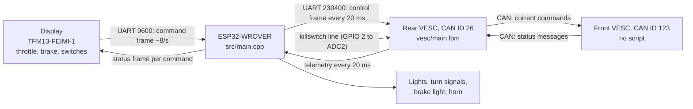
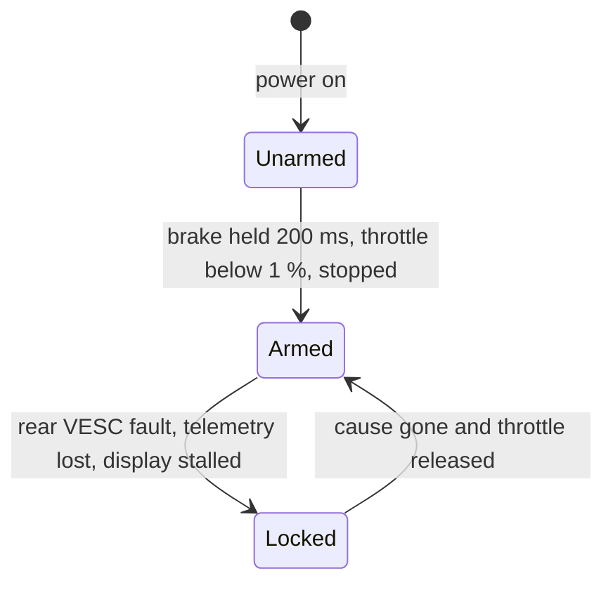

# Architecture

The scooter's original controllers are replaced by two VESC motor controllers. The original display (TFM13-FEIMI-1) stays, and an ESP32 sits between the display and the rear VESC, taking the place of the original controller from the display's point of view.

## Who Does What

| Part | Runs | Responsible for |
|---|---|---|
| Display | Original firmware | Reads the throttle, brake and handlebar switches; shows speed, mode and error codes; holds the P-menu settings. |
| ESP32 | [src/main.cpp](../src/main.cpp) with [lib/KukirinDisplay](../lib/KukirinDisplay) and [lib/VESCBridge](../lib/VESCBridge) | Answers the display, turns rider inputs into a throttle and brake request, brake-to-start, lockouts after faults, the killswitch line, lights and horn, fault codes on the display. |
| Rear VESC | [vesc/main.lbm](../vesc/main.lbm) (LispBM) | Current commands for both motors, regen fade-in with speed, the per-wheel speed limit, hill hold, the dead-man timeout, watching the front VESC. |
| Front VESC | VESC firmware only | Follows CAN commands from the rear VESC; its own timeout stops the motor if they stop. |

The split follows one rule: anything that must keep working when the ESP32 link fails runs on the VESC. That is why the speed limit and the dead-man timeout are in the LispBM script rather than on the ESP32.

## One Control Cycle

1. The display sends a 20-byte command frame about every 125 ms ([protocol](protocol/)).
2. The ESP32 checks the checksum and the field ranges, filters the inputs, and answers immediately with a status frame. The display shows E-006 if answers stop for about 2.5 s.
3. In the same loop pass the ESP32 builds a control frame: throttle scaled to the selected mode, brake from the P-menu PB level, dual drive, and the mode speed limit. Throttle rises at a rate set by the PA level and drops at once. The frame goes to the rear VESC right away, and every 20 ms between display frames so the VESC's dead-man timer stays fed. Control frames are sent only while telemetry from the VESC arrives (see Failure Handling).
4. The rear VESC script runs every 20 ms: it reads the newest control frame, applies brake or drive to both motors, and sends back the speed of the faster wheel plus fault flags.
5. The ESP32 forwards that speed to the display and turns the fault flags into lockouts and display error codes.

Timing values are defined once in code: [`PowertrainConfig`](../lib/VESCBridge/src/VESCSafety.h) on the ESP32 and the constants at the top of [vesc/main.lbm](../vesc/main.lbm). `tools/check_shared_constants.py` checks that the two agree.

## Threads

- ESP32: everything runs in the Arduino `loop()` on one core. The loop never waits for a frame, but some steps block briefly: sending a log frame to the VESC can busy-wait up to 2 ms, and the libraries wait up to 2-10 ms for a mutex. It yields for 1 ms when there was nothing to do.
- Rear VESC: two LispBM threads. `thd-powertrain-50hz` runs every 20 ms. `thd-can-supervisor` runs every 100 ms and marks the front VESC offline after 500 ms without its CAN status message. A third, short-lived thread plays the arming tone.

## Arming

- Unarmed: the ESP32 holds the killswitch line low. The script reads it on ADC2 and keeps both motors at zero current, whatever the control frames say.
- Brake-to-start is checked on the ESP32 (it needs telemetry, for the speed). The script additionally arms only with the throttle released and the rear wheel stopped.
- Locked: drive is zero but the killswitch line stays high, so a fault while riding in traffic does not require stopping for a new brake-to-start. The rider releases the throttle to continue. These lockouts are on the ESP32; the script's own dead-man cut does not lock, and drive resumes as soon as control frames return ([pitfalls](pitfalls.md#drive-resumes-at-once-after-a-dead-man-cut)).
- The ESP32 never returns to Unarmed after arming; only a power cycle or an ESP32 reset does. The script disarms by itself if it reads the killswitch line low (see below).

## Failure Handling

| Failure | Detected by | Response | Display |
|---|---|---|---|
| Display frames stop | ESP32, 500 ms without a valid frame | Throttle zero until frames return and the throttle is released | E-006 from the display itself after about 2.5 s without replies; E-002 once frames return, until the throttle is released |
| Control frames to the VESC lost | Script: no valid frame for 500 ms | Script cuts both motors. When frames return, drive resumes at the requested throttle at once ([pitfalls](pitfalls.md#drive-resumes-at-once-after-a-dead-man-cut)) | None while telemetry still arrives |
| Telemetry from the VESC lost | ESP32: no telemetry for 500 ms | ESP32 locks drive and stops sending control frames until telemetry returns and the throttle is released. The script keeps the last throttle and brake until its dead-man cut, up to 500 ms later ([pitfalls](pitfalls.md#the-esp32-stops-sending-control-frames-when-telemetry-is-lost)) | E-003, speed 0 |
| Front VESC lost (CAN) | Script: no front status for 500 ms. Front VESC: no commands for its VESC Tool timeout (500 ms) | Script stops commanding the front, zero current included; the front stops on its own timeout ([pitfalls](pitfalls.md#the-front-vesc-is-not-told-to-stop-when-it-is-marked-offline)). Rear keeps the full mode limit. Dual drive returns after the front is back and the throttle is released | E-017 |
| Rear VESC fault (over-current, over-temperature, ...) | Rear VESC fault code in telemetry | Script cuts motors while the fault is active; ESP32 locks drive until it clears and the throttle is released | E-002 |
| Front VESC fault | Not watched | The front stops for its fault stop time, then follows commands again ([pitfalls](pitfalls.md#front-vesc-faults-are-not-watched)) | None |
| ESP32 stops running | Rear VESC | No control frames: the dead-man timeout cuts the motors after 500 ms | |
| Killswitch line low | Script reads ADC2 below 1.65 V, one reading is enough | Motors off, regen included; the script arms again by itself once the rear wheel has stopped and the throttle is released ([pitfalls](pitfalls.md#one-low-killswitch-reading-disarms-the-script)) | E-002 only when the ESP32 drove the line low |
| Throttle wiring fault | ESP32: raw throttle above 1050 of 1000 | Frame rejected, throttle not used | |
| Corrupted frame on either link | Checksum (display) or CRC16 (VESC link) | Frame dropped. The ESP32 searches the received bytes for the next frame start; the script discards one byte and tries again | |

When two faults are active, the display alternates between their codes every second.

## Braking

Braking is regenerative only, through the VESCs' current braking mode (`set-brake-rel`). Strength comes from the P-menu PB level (0-5), fades in per wheel from 5 to 20 mph, and is zero below 5 mph: in brake mode a VESC applies current against the sign of the measured speed, and near standstill that sign is noise that can drive the wheel. The mechanical brakes stop the scooter. After 1 s stopped with the brake held, hill hold applies the full PB level to resist rolling back. The VESC handbrake mode is not used because it pushes holding current through a stopped motor and heats the coils. Details: [powertrain](powertrain.md).

## Repository Layout

| Path | Contents |
|---|---|
| `src/main.cpp` | ESP32 application |
| `lib/KukirinDisplay/` | Display protocol and driver |
| `lib/VESCBridge/` | VESC serial link and safety supervisor |
| `lib/BTAudio/` | Planned motor-coil audio, not used by the firmware |
| `vesc/main.lbm` | Rear VESC script |
| `test/` | Unit tests run on a PC (`pio test -e native`) |
| `tools/` | Lint, constant cross-check, firmware comparison |
| `docs/` | This documentation |
| `third_party/` | Pinned upstream sources: VESC firmware and VESC Tool, LispBM, Junk495's G2 Pro work |
