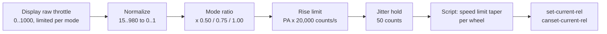

# Powertrain

How rider input becomes motor current, in firmware v1.0.0. The ESP32 turns the display's throttle and brake into a request; the rear VESC's script ([vesc/main.lbm](../vesc/main.lbm)) turns the request into current commands for both motors. Controller settings are listed in [system_spec.md](system_spec.md); firmware constants are in `PowertrainConfig` ([lib/VESCBridge/src/VESCSafety.h](../lib/VESCBridge/src/VESCSafety.h)) and at the top of the script.

## Command Scale

Throttle and brake travel from the ESP32 to the script as counts from 0 to 10000. The script divides by 10000 and sends a relative command:

- Drive: `set-current-rel` (rear) and `canset-current-rel` (front). 1.0 means the motor current limit set in VESC Tool (`l_current_max`).
- Brake: `set-brake-rel` and `canset-brake-rel`. 1.0 means the magnitude of the motor's braking current limit (`l_current_min`).

So 10000 counts is 100 % of whatever the VESCs are configured for, and 100 counts is 1 %. The firmware never deals in amps, which keeps it independent of VESC Tool tuning. The VESCs then apply their own limits on top: battery current, temperature and voltage derating, and the hardware limits of the controller (see [system_spec.md](system_spec.md)). Both motors get the same relative command, so with the same settings on both VESCs they draw about the same current. `PowertrainConfig` still contains an amp value (`MOTOR_MAX_CURRENT_AMPS`) and amp figures in comments; they are not used for control and are due to be removed.

## Throttle Path

1. The display sends a raw throttle value from 0 to 1000 and already limits it according to the selected mode (see [protocol/README.md](protocol/README.md)).
2. The display library filters and normalizes it ([KukirinG3ProProtocol.h](../lib/KukirinDisplay/src/KukirinG3ProProtocol.h), `ThrottleConfig`). Two switches with hysteresis come first: the throttle starts counting above 25 and drops back to 0 below 15, and it snaps to 1000 at 975 and lets go below 965. The result is then mapped linearly: 15 or less is 0, 980 or more is 1.
3. `compute_mode_scaled_throttle` multiplies by the mode ratio and by 10000.
4. `compute_safe_control` limits how fast the request may rise, by the P-menu PA level: PA x 20,000 counts per second, so full scale takes 0.5 s at PA 1 and 0.1 s at PA 5. Releasing the throttle takes effect at once.
5. A new value is sent only when it has moved by 50 counts (0.5 %), reaches zero, or reaches a mode ceiling. This keeps small hand movements while holding speed from reaching the motors.
6. The script applies the per-wheel speed limit (below) and sends the commands. It also contains a limit meant to raise the throttle by at most 2000 counts per 20 ms pass after a gap in control frames of more than 35 ms. That limit never acts: the script measures the gap after storing the arrival time of the new frame, so the gap is always close to zero. A frame arriving after a gap is applied at once ([pitfalls](pitfalls.md#drive-resumes-at-once-after-a-dead-man-cut)).

### The Mode Ratio Compounds With The Display Limit

The mode ratios were written for a raw throttle that always reaches 1000. The display already limits the raw value per mode, so in v1.0.0 the two reductions multiply. At full throttle:

| Mode | Raw maximum from the display | Normalized | ESP32 ratio | Command | Share of the current limit |
|---|---|---|---|---|---|
| 1 | 360 | 0.358 | 0.50 | 1788 counts | 17.9 % |
| 2 | 680 | 0.689 | 0.75 | 5168 counts | 51.7 % |
| 3 | 1000 | 1.000 | 1.00 | 10000 counts | 100 % |

The command column is calculated from the code; the raw maximums come from the 2026-08-25 bench notes and are due to be re-checked ([protocol/verification.md](protocol/verification.md)). The intended mode ceilings of 5000 and 7500 counts (`MODE_1_MAX_COUNTS`, `MODE_2_MAX_COUNTS`) are only used when the normalized throttle reaches 1, which the display never sends in modes 1 and 2. This is why mode 1 feels weak.

Planned for v1.1: remove the ESP32 mode ratio and let the display's limit be the only per-mode scaling. Full throttle then gives about 36 % in mode 1 and 69 % in mode 2. The per-mode speed limits stay.

## Speed Limits

Mode 1 is limited to 15 mph (671 cm/s), mode 2 to 28 mph (1252 cm/s), mode 3 has no limit. These match the scooter's original controller. The ESP32 sends the limit for the selected mode in every control frame; the script applies it to each wheel separately, using that wheel's own speed (`get-speed` for the rear, `canget-speed` for the front):

- below the limit minus 3 mph (1.341 m/s): the full throttle command;
- in the last 3 mph: the command scaled down linearly to zero at the limit;
- at or above the limit: zero drive current (not braking).

The limit lives in the script so that it keeps working if the ESP32 link fails, and per wheel so that a wheel spinning faster than the other (a lifted or slipping front wheel) loses drive on its own. The ESP32 also contains an older speed governor; the firmware passes it a speed of 0 so it never acts, and it is due to be removed.

## Regenerative Braking

The brake lever is a switch: the display reports pulled or released, not how far. While it is pulled:

- the ESP32 sends zero throttle and a brake command of PB x 2000 counts, where PB is the P-menu regen level from 0 to 5 (PB 0 means no regen);
- the script scales the brake command for each wheel by that wheel's speed: zero at 5 mph (2.235 m/s) and below, rising linearly to the full PB level at 20 mph (8.941 m/s) and above (the script ridden most recently used 3 and 15 mph as a local edit; v1.0.1 starts regen at the stationary threshold, 0.6 mph, and reaches the full level at 15 mph);
- where the scaled command is zero, the script sends zero current (`set-current 0`, `canset-current 0`) instead of a zero brake command.

Releasing the brake with the throttle still open keeps the throttle at zero until it is released, so the scooter does not surge when the rider lets go of the brake.

The floor exists because, without it, the front wheel was seen being driven forward while braking at low speed. Below the floor the mechanical brakes stop the scooter. The floor and full-regen speeds were then set by feel on rides.

Why brake mode drove the wheel is not confirmed. VESC brake mode applies current against the sign of the measured speed (`iq = -SIGN(speed) * |iq|`, [mcpwm_foc.c](../third_party/vesc_firmware_v7/motor/mcpwm_foc.c) line 3437), and near standstill the speed estimate is mostly noise. The firmware guards against this: when the speed or voltage sign changes, or the duty cycle is close to zero, it shorts the phases (duty 0) until the braking current is reached (lines 3330-3347). How current still drove the wheel past that guard has not been worked out.

### Hill Hold (Known Issue)

When both wheels are below 0.6 mph (0.268 m/s) with the brake held for more than 1 s, the script applies the full PB level to both motors regardless of speed, until the brake is released. It was meant to resist rolling back on a slope with less force on the lever. It turns on by itself whenever the scooter stops with the brake held and PB is above 0.

This puts the VESC brake mode at standstill, the region the regen floor exists to avoid. Observed on flat ground: when regen comes back on at a stop, the motors draw current and turn to a fixed position; rarely, the wheel has moved backwards or forwards. That is a safety problem.

The cause is not confirmed. One idea: at zero speed `SIGN(0)` is +1 ([utils_math.h](../third_party/vesc_firmware_v7/util/utils_math.h) line 58), so brake mode would apply current against the forward direction, at the rotor angle the VESC estimates from the hall sensors in 60 electrical degree steps; the rotor would turn until it lines up with that current. Against this, the duty-0 guard described above should short the phases at standstill rather than drive them. VESC brake mode is designed to slow a turning motor, not to hold a stopped one, so the fix keeps it away from standstill whatever the exact cause.

A bench check can confirm it: with the wheels stopped, hold the brake with PB above 0 and watch the motor current in VESC Tool. If the current and movement start about 1 s after the wheels stop, and never with PB 0, hill hold is the cause.

Planned fix for v1.0.1: hill hold stays, but brakes a wheel only while that wheel turns faster than the stationary threshold (0.6 mph, 0.268 m/s). A stopped wheel gets zero current; a wheel that starts rolling, for example backwards down a slope, gets the full PB level against its motion, where the speed sign is reliable.

### Why Not The VESC Handbrake Mode

The VESC also has a handbrake mode (`set-handbrake`). It applies a fixed current vector in open loop ([mcpwm_foc.c](../third_party/vesc_firmware_v7/motor/mcpwm_foc.c) lines 852 and 3587-3589), which holds the rotor in place with current flowing through the windings for as long as it is commanded, whether or not the wheel is trying to move. The heat is I²R in a stationary hub motor with little cooling. The script never uses it.

## Coasting

When the throttle is released while a wheel is rolling (above 500 ERPM, about 1 mph), the script commands zero current with a 1 s off-delay and repeats this every 20 ms. The VESC keeps switching with zero current instead of turning its output stage off, so the next throttle input engages smoothly. Once the wheel drops below 500 ERPM, the command is sent without the delay, and the VESC stops switching when the remaining delay runs out.

The front motor's zero-current command with an off-delay uses `canset-current-rel`, because VESC firmware 7.00 decodes the off-delay of `canset-current` in the wrong field order (see [AGENTS.md](../AGENTS.md)).

Loss of arming, the killswitch, a VESC fault and the 500 ms dead-man timeout command zero current at once, without a new off-delay (`cut-motors` in the script). An off-delay already running still counts down, with zero current. After a dead-man cut, drive returns at the requested throttle as soon as control frames arrive again, without a ramp and without the throttle being released first ([pitfalls](pitfalls.md#drive-resumes-at-once-after-a-dead-man-cut)).

## Single Motor Operation

The rider can switch dual drive off; the front then gets zero current (not brake mode) and the rear drives alone. If the front VESC stops sending CAN status messages for 500 ms, the script treats it as offline, stops commanding it (zero current included, so the front keeps its last command until its own 500 ms timeout stops it; see [pitfalls](pitfalls.md#the-front-vesc-is-not-told-to-stop-when-it-is-marked-offline)) and drives the rear alone with the full mode ceiling: one working motor is better than none. When the front comes back, the ESP32 keeps dual drive off until the throttle is released, so the front does not join in mid-throttle.

## Speed And Motor Speed

The VESCs report electrical RPM (ERPM). Wheel speed follows from the pole pairs and the wheel diameter:

v = ERPM / pole pairs x pi x d / 60

With 15 pole pairs and a 10 in (0.254 m) wheel, 1 ERPM is 0.000887 m/s, so 300 ERPM is 0.27 m/s (0.6 mph) and 500 ERPM is 0.44 m/s (1.0 mph). `get-speed` uses the wheel diameter and pole pairs set in VESC Tool. 10 in is the nominal tyre size, not a measured rolling diameter; how close the reported speed is to road speed has not been measured. A comparison against GPS is planned.

## Open Questions

- The raw throttle maximums per mode (360, 680, 1000) are from bench notes and are scheduled for re-checking.
- The wheel settings in VESC Tool are to be confirmed from a settings export.
- Why brake mode drove the front wheel at low speed, given the firmware's duty-0 guard.
- Hill hold: the cause of the movement at standstill is still to be confirmed on the bench, and the v1.0.1 fix tested the same way (see above).
- Whether brake mode reads the speed sign reliably at 0.6 mph has not been measured; if a wheel still twitches with the fix, the hill hold threshold needs raising.
